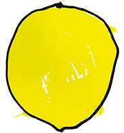
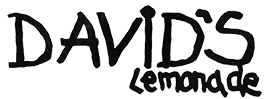

#  

Il s'agit d'un site réalisé lors du module interface homme-machine durant ma première année de DUT informatique pour l'association fictive Combava.

Cliquer sur le lien ci-dessous pour voir notre réalisation : 
https://duffscs.github.io/david-lemonade/

## Contexte :

L'association Combava, qui regroupe des producteurs indépendants d'agrumes du sud de la France, cherche une façon de se faire connaître,tant auprès des magasins que des clients. Elle a eu l'idée d'organiser des dégustations privées, "VIP", de citronnade tout autour du pays, à la façon des négociants en vin.  Combava a eu l'autorisation d'utiliser le nom et l'identité graphique de "David's Lemonade" afin de promouvoir ces événements.

## Demande du client :

Combava souhaite réaliser une page web, un "one-page" pour présenter brièvement l'association, mais surtout les dégustations de citronnade, localiser ces événements et donner la possibilité de s'y inscrire.

## Réalisation :

Dans ce repository vous retrouverez le site réalisé, le dossier de fonts et les différentes maquettes. 

## Contributeur :
- https://github.com/Duffscs
- https://github.com/Apokalypt 
- https://github.com/Hervebeteau
